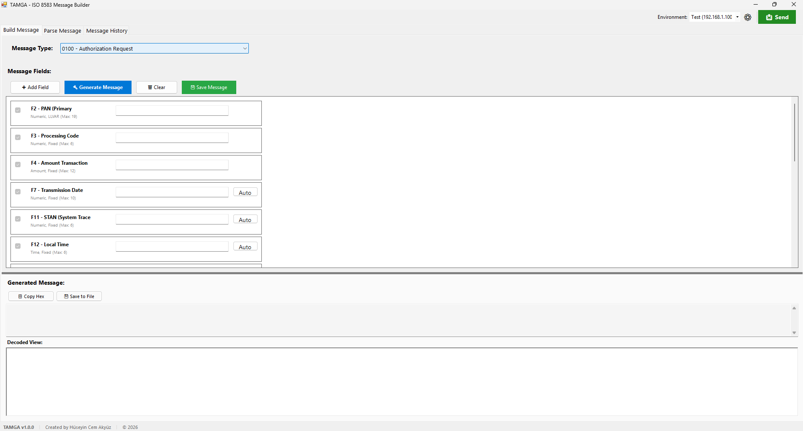
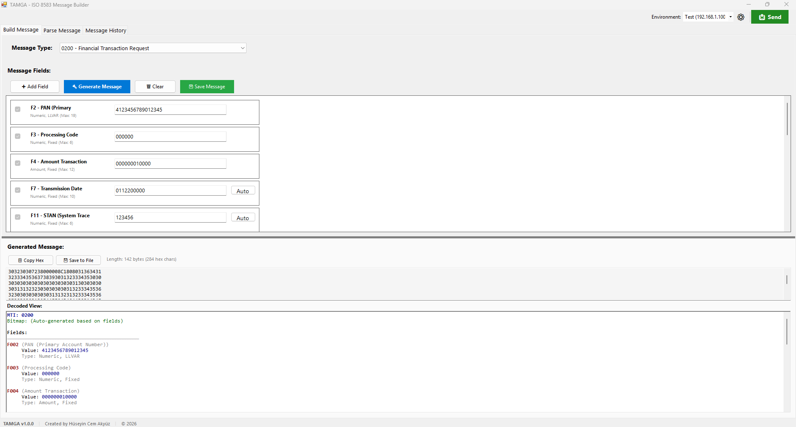
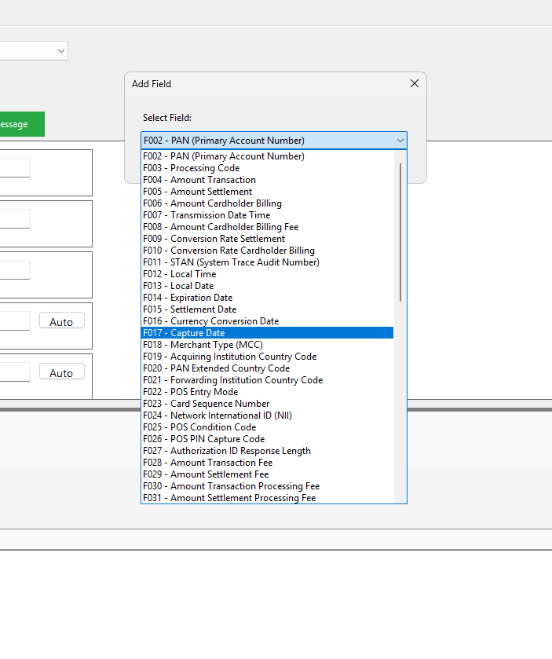
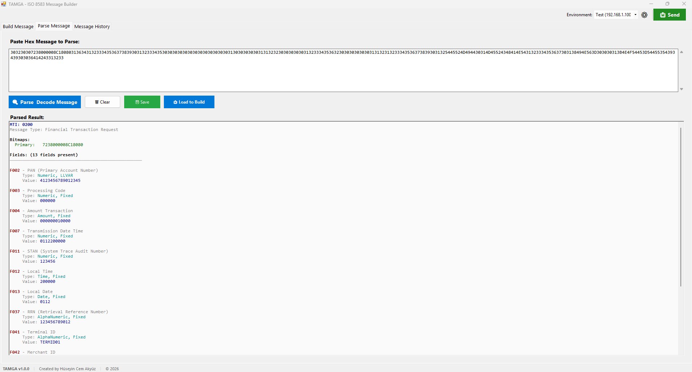
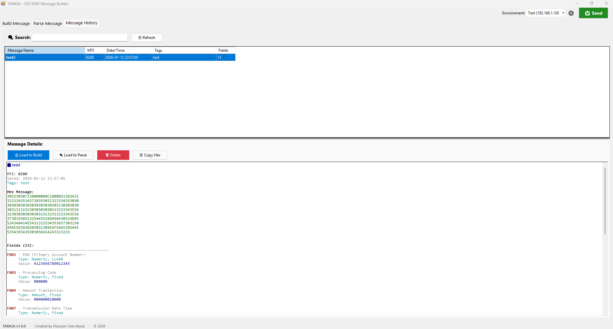
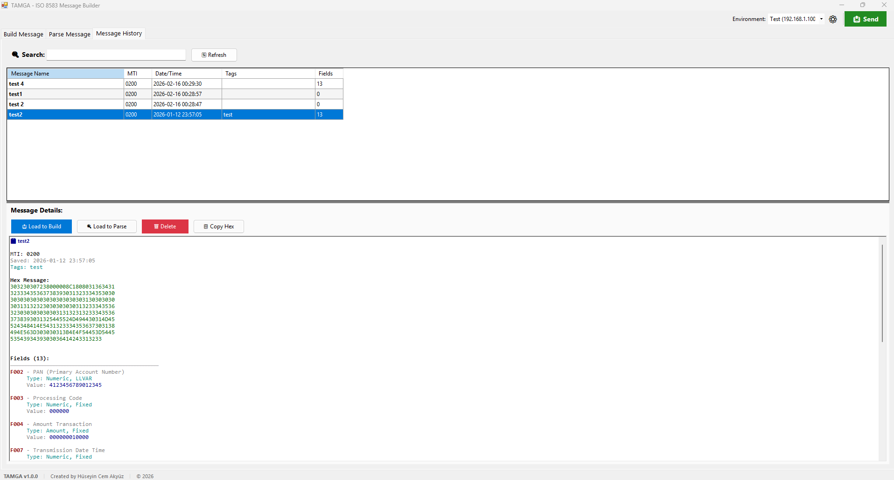
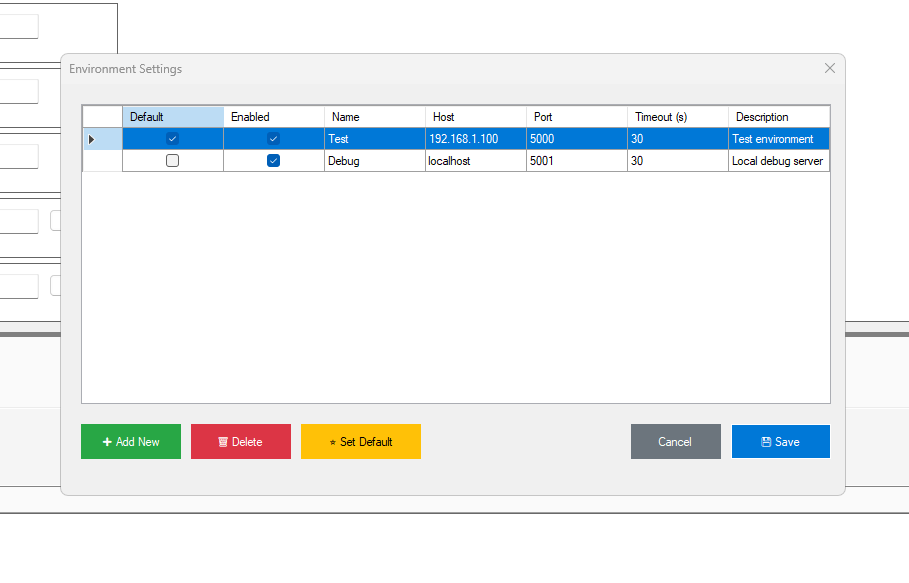

# TAMGA - ISO 8583 Message Builder


A Windows desktop application for building, parsing, and managing ISO 8583 financial messages.

[🇹🇷 Türkçe README için tıklayın](https://github.com/huseyincemakyuz/Tamga/blob/master/README_TR.md)



---

## 🎯 What is ISO 8583?

ISO 8583 is an international standard for financial transaction card messages used in ATM, POS, and card payment systems. TAMGA helps you easily create and analyze these messages without manual hex calculations.

---

## ✨ Features

### 🔨 Build Tab
- **Build messages** from predefined templates (0200, 0400, 0800, etc.)
- **Dynamic field addition/removal**
- **Auto-generate values** for common fields (Date, Time, STAN, RRN)
- **Real-time hex output** with live preview
- **Color-coded display** for better readability
- **Save messages** with labels and notes



**Add Field Dialog:**



### 🔍 Parse Tab
- **Convert hex messages** to readable format
- **Field-by-field details** with type information
- **Error detection** and validation warnings
- **Load to Build** - edit parsed messages
- **Save parsed messages** to history



### 📚 History Tab
- **View all saved messages** in a sortable table
- **Search and filter** by name, MTI, or tags
- **Load to Build/Parse tabs** for reuse
- **Delete** unwanted messages
- **Copy hex values** to clipboard





### 🌐 TCP/IP Integration ⭐ NEW!
- **Multi-environment management** - Test, Debug, Production environments
- **Send messages to gateways** - Real-time testing
- **Automatic response receiving and parsing**
- **Environment-based settings** - Host, Port, Timeout
- **Easy switching** - Change environment via dropdown
- **Keyboard shortcut** - Quick send with `Ctrl+Enter`



### 🎯 Advanced Features
- **Parse → Build workflow** - Parse a message and edit it
- **Auto RRN generation** based on STAN (F11 → F37 dependency)
- **Template system** for quick message creation
- **JSON storage** - portable and readable
- **No installation required** - portable executable

---

## 🚀 Quick Start

### Download & Run
1. Download the latest version from [Releases](../../releases) page
2. Extract the ZIP file
3. Run `Tamga.exe`
4. No installation required!

### System Requirements
- **Operating System**: Windows 7 or higher
- **Framework**: .NET Framework 4.7.2 (usually pre-installed)
- **Disk Space**: ~5 MB

---

## 📖 User Guide

### Building Messages

1. Open the **Build** tab
2. Select message type from dropdown (e.g., "0200 - Authorization Request")
3. Required fields (marked with `*`) are automatically added
4. Fill in the required fields
5. Click **Add Field** to add optional fields
6. Use **Auto** buttons to generate values:
   - **F7**: Transmission Date/Time (MMDDhhmmss)
   - **F11**: STAN - 6-digit random number
   - **F12**: Local Time (hhmmss)
   - **F13**: Local Date (MMDD)
   - **F37**: RRN (requires F11 to be filled first)
7. Click **Generate Message** to create hex output
8. Click **Save Message** to store for later use

**Example:**
```
Message Type: 0200 - Authorization Request
F2 (PAN): 4111111111111111
F3 (Processing Code): 000000
F4 (Amount): 000000010000 (100.00)
F11 (STAN): 123456 (Auto-generated)
F37 (RRN): 5023171234 (Auto-generated from F11)

Generated Hex:
0200B23A40010AA0000216411111111111111100000000000001000012345650231712345...
```

---

### Parsing Messages

1. Open the **Parse** tab
2. Paste hex message into the input box
3. Click **Parse & Decode Message**
4. View parsed fields:
   - MTI (Message Type Indicator)
   - Primary/Secondary bitmaps
   - Field-by-field details
5. **(Optional)** Click **Load to Build** to edit the parsed message
6. **(Optional)** Click **Save** to store in history

**Example Input:**
```
0200B23A40010AA0000216411111111111111100000000000001000012345650231712345...
```

**Example Output:**
```
MTI: 0200
Message Type: Authorization Request

Bitmaps:
  Primary: B23A40010AA00002

Fields: (5 fields present)
──────────────────────────────────
F002 - Primary Account Number (PAN)
     Type: n, LLVAR
     Value: 4111111111111111

F003 - Processing Code
     Type: n 6, Fixed
     Value: 000000

F004 - Amount, Transaction
     Type: n 12, Fixed
     Value: 000000010000

F011 - System Trace Audit Number (STAN)
     Type: n 6, Fixed
     Value: 123456

F037 - Retrieval Reference Number (RRN)
     Type: an 12, Fixed
     Value: 5023171234

✓ Message parsed successfully!
```

---

### TCP/IP Message Sending ⭐ NEW!

#### Configuring Environments

1. Click the **⚙️ Settings** button in the toolbar
2. Add a new environment with **➕ Add New**
3. Enter environment details:
   - **Name**: Environment name (e.g., Test, Production)
   - **Host**: Gateway IP address or hostname
   - **Port**: Gateway port number
   - **Timeout**: Response wait time (in seconds)
   - **Description**: Environment description (optional)
4. Select the default environment with the **Default** checkbox
5. Save with **💾 Save**


#### Sending Messages

1. Select the target environment from the **Environment** dropdown in the toolbar
2. Prepare your message in any tab:
   - **Build**: Create a new message
   - **Parse**: Use existing hex message
   - **History**: Select a saved message
3. Click the **📤 Send** button (or use `Ctrl+Enter` shortcut)
4. The sent message and received response are displayed automatically
5. If successful, the response is automatically parsed

**Note:** TCP/IP integration may require customization in the `MessageSender.cs` file's TODO sections, as each gateway may have its own message format.

---

### History Management

1. Open the **History** tab
2. View all saved messages in the table
3. Use the search box to filter by name, MTI, or tags
4. Click on a message to view details in the preview panel
5. Actions:
   - **Load to Build**: Open the message in Build tab for editing
   - **Load to Parse**: Open the message in Parse tab
   - **Delete**: Remove the message from history
   - **Copy Hex**: Copy hex value to clipboard

---

## ⚙️ Configuration Files

### Environment Settings
Environment settings are automatically stored at:
```
C:\Users\{Username}\AppData\Roaming\Tamga\environments.json
```

**Example `environments.json`:**
```json
{
  "Environments": [
    {
      "Id": "1",
      "Name": "Test",
      "Host": "192.168.1.100",
      "Port": 5000,
      "TimeoutSeconds": 30,
      "IsDefault": true,
      "IsEnabled": true,
      "Description": "Test environment"
    },
    {
      "Id": "2",
      "Name": "Production",
      "Host": "10.0.0.50",
      "Port": 6000,
      "TimeoutSeconds": 60,
      "IsDefault": false,
      "IsEnabled": true,
      "Description": "Production environment"
    }
  ]
}
```

### Message History
Saved messages are stored at:
```
C:\Users\{Username}\AppData\Roaming\Tamga\messages.json
```

---

## 🎓 ISO 8583 Field Reference

### Common Fields

| Field | Name | Type | Length | Example |
|-------|------|------|--------|---------|
| **F2** | PAN (Card Number) | LLVAR | max 19 | 4111111111111111 |
| **F3** | Processing Code | Fixed | 6 | 000000 |
| **F4** | Amount | Fixed | 12 | 000000010000 |
| **F7** | Transmission Date/Time | Fixed | 10 | 0129173045 |
| **F11** | STAN | Fixed | 6 | 123456 |
| **F12** | Local Time | Fixed | 6 | 173045 |
| **F13** | Local Date | Fixed | 4 | 0129 |
| **F37** | RRN | Fixed | 12 | 5023171234 |
| **F39** | Response Code | Fixed | 2 | 00 |
| **F41** | Terminal ID | Fixed | 8 | TERM0001 |
| **F42** | Merchant ID | Fixed | 15 | MERCHANT0000001 |

### Message Types (MTI)

| MTI | Description |
|-----|-------------|
| **0200** | Authorization Request |
| **0210** | Authorization Response |
| **0400** | Reversal Request |
| **0410** | Reversal Response |
| **0800** | Network Management Request |
| **0810** | Network Management Response |

---

## 🛠️ Technical Details

### Technology Stack
- **Language**: C# 7.3
- **Framework**: .NET Framework 4.7.2
- **UI**: Windows Forms
- **Storage**: JSON (Newtonsoft.Json 13.0.4)
- **Network**: System.Net.Sockets (TCP/IP)
- **Architecture**: Event-Driven, Tab Manager Pattern

### Project Structure
```
Tamga/
├── Forms/
│   ├── MainForm.cs                  # Main window (TabControl + Toolbar)
│   ├── ComboBoxItem.cs              # Helper class
│   ├── AddFieldDialog.cs            # Field selection dialog
│   ├── SaveMessageDialog.cs         # Save with label/note
│   ├── Dialogs/
│   │   └── EnvironmentSettingsDialog.cs  # Environment management
│   └── Tabs/
│       ├── BuildTabManager.cs       # Message building logic
│       ├── ParseTabManager.cs       # Message parsing logic
│       └── HistoryTabManager.cs     # Storage management
├── Models/
│   ├── Iso8583MessageBuilder.cs     # Core message builder
│   ├── Iso8583MessageParser.cs      # Core message parser
│   ├── MessageStorageManager.cs     # JSON persistence
│   ├── MessageSender.cs             # TCP/IP sender
│   ├── MessageSenderHelper.cs       # UI integration
│   ├── ServerEnvironment.cs         # Environment model
│   ├── EnvironmentSettings.cs       # Environment settings management
│   ├── MessageResponse.cs           # Response model
│   ├── FieldDefinition.cs           # Field metadata
│   ├── ParsedMessage.cs             # Parser results
│   ├── SavedMessage.cs              # Storage model
│   └── Iso8583Fields.cs             # Field definitions (F2-F128)
├── Controls/
│   └── FieldControl.cs              # Custom field input control
├── Templates/
│   └── MessageTemplates.cs          # MTI templates
└── Program.cs                       # Entry point
```

### Design Patterns
- **Tab Manager Pattern**: Each tab has a dedicated manager class
- **Event-Driven Architecture**: Loose coupling between components
- **Repository Pattern**: MessageStorageManager abstracts data access
- **Builder Pattern**: Step-by-step message construction
- **Singleton Pattern**: EnvironmentSettings global configuration management

---

## 🔧 Developer Notes

### Customizing TCP/IP Integration

In the `MessageSender.cs` file, you can customize the message sending and receiving code according to your gateway's expected format:
```csharp
// Customize the TODO sections for your format:

// Example Format 1: ASCII Length + Binary Message
string length = binaryMessage.Length.ToString();
await stream.WriteAsync(Encoding.ASCII.GetBytes(length));
await stream.WriteAsync(binaryMessage);

// Example Format 2: Binary Length (2-byte) + Binary Message
byte[] lengthBytes = BitConverter.GetBytes((short)binaryMessage.Length);
if (BitConverter.IsLittleEndian) Array.Reverse(lengthBytes);
await stream.WriteAsync(lengthBytes);
await stream.WriteAsync(binaryMessage);
```

Common gateway formats:
- **ASCII Length + Binary Message**: `"19"` + `[0x30, 0x32, ...]`
- **Binary 2-byte Length**: `[0x00, 0x13]` + `[0x30, 0x32, ...]`
- **Binary 4-byte Length**: `[0x00, 0x00, 0x00, 0x13]` + `[0x30, ...]`

---

## 📄 License

This project is licensed under the MIT License - see the [LICENSE](LICENSE) file for details.

---

